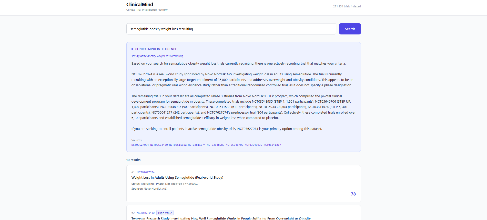
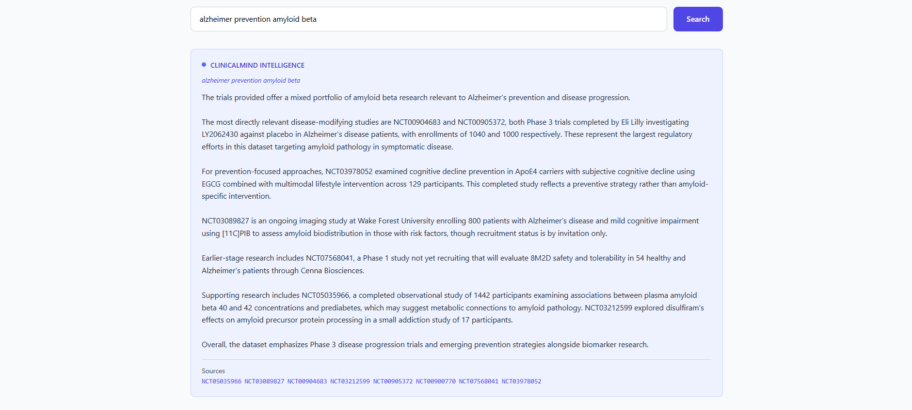

# ClinicalMind

AI-powered clinical trial intelligence platform built on 271,954 real trials from ClinicalTrials.gov.

## The Problem

Navigating clinical trial data is painful. A pharma researcher trying to understand the competitive landscape for a new drug has to manually search ClinicalTrials.gov, read through hundreds of abstracts, cross-reference sponsors, phases, and enrollment numbers, and piece together a picture that should take minutes but takes days.

## The Solution

ClinicalMind lets you search 271,954 real trials using natural language and get back an intelligent analysis in seconds. What would take a research analyst half a day now takes 10 seconds.

## Screenshots





## Tech Stack

| Layer | Technology |
|---|---|
| Frontend | React, TypeScript, Tailwind CSS |
| Backend | FastAPI, Python |
| AI Analysis | Claude claude-haiku-4-5 (Anthropic) |
| Vector Search | FAISS with neural embeddings |
| Embedding Model | all-MiniLM-L6-v2 (384 dimensions) |
| Data | 271,954 trials from ClinicalTrials.gov API |

## Features

- Semantic search across 271,954 clinical trials
- AI-powered analysis with specific NCT ID citations
- High-value trial flagging for Phase 3 and 4 trials
- Relevance scoring for each result
- Direct links to ClinicalTrials.gov
- Clean prose AI responses

## Architecture

```
React Frontend (TypeScript)
        |
        | HTTP
        |
FastAPI Backend (Python)
        |               |
FAISS Neural        Claude AI
Vector Search       (Anthropic)
(271k vectors)
        |
ClinicalTrials.gov data
```

## Data Pipeline

```bash
python pipeline/fetch_trials.py      # Fetch 271,954 trials from ClinicalTrials.gov API
python pipeline/clean_trials.py      # Clean, standardise, and build RAG text fields
python pipeline/embed_neural.py      # Generate neural embeddings and build FAISS index
```

## Setup

### Prerequisites

- Python 3.11+
- Node.js 18+
- Anthropic API key

### Backend

```bash
git clone https://github.com/nithishdeenadayalan/clinicalmind.git
cd clinicalmind

pip install fastapi uvicorn faiss-cpu sentence-transformers torch pandas scikit-learn anthropic python-dotenv

echo "ANTHROPIC_API_KEY=your_key_here" > .env

python pipeline/fetch_trials.py
python pipeline/clean_trials.py
python pipeline/embed_neural.py

python -m uvicorn api.main:app --reload --port 8000
```

### Frontend

```bash
cd frontend
npm install
npm start
```

Open http://localhost:3000

## API Endpoints

| Method | Endpoint | Description |
|---|---|---|
| POST | /search/ | Semantic search across 271k trials |
| POST | /intelligence/ | Claude AI analysis of search results |
| GET | /search/{nct_id} | Get specific trial by NCT ID |
| GET | /health | API health check |

## Example Queries

- `pembrolizumab lung cancer phase 3`
- `semaglutide obesity weight loss recruiting`
- `alzheimer prevention amyloid beta`
- `CAR-T cell therapy leukemia completed`
- `NIH cardiovascular disease prevention`

## Project Structure

```
clinicalmind/
├── api/
│   ├── main.py
│   ├── routers/
│   │   ├── search.py
│   │   └── intelligence.py
│   └── services/
│       ├── search_service.py
│       └── claude_service.py
├── pipeline/
│   ├── fetch_trials.py
│   ├── clean_trials.py
│   └── embed_neural.py
├── frontend/
│   └── src/
│       ├── App.tsx
│       ├── api/client.ts
│       └── components/
│           ├── TrialCard.tsx
│           └── IntelligencePanel.tsx
├── .gitignore
├── LICENSE
└── README.md
```

## Data Sources

ClinicalTrials.gov API v2 across 17 therapeutic areas including cancer, diabetes, cardiovascular disease, depression, Alzheimer, COVID-19, hypertension, obesity, asthma, HIV, Parkinson, multiple sclerosis, rheumatoid arthritis, breast cancer, lung cancer, stroke, and kidney disease.

## License

MIT License
